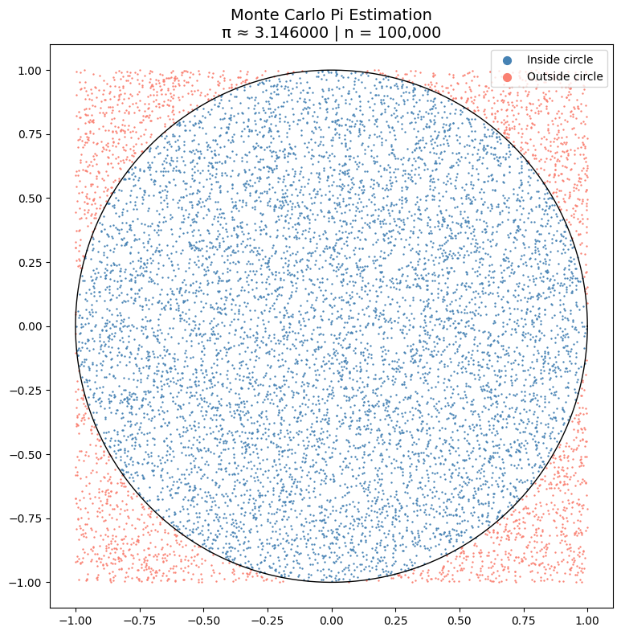
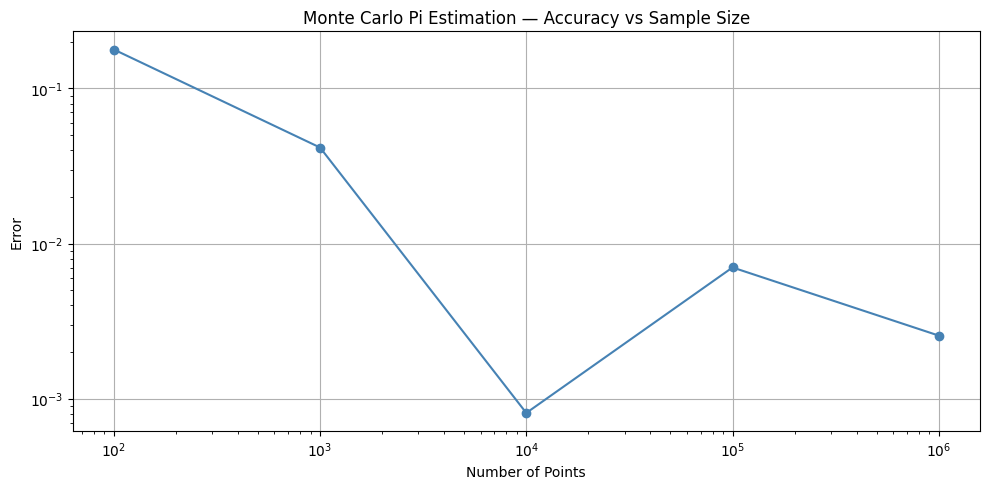

# 🎯 Monte Carlo Pi Estimation

Estimating the value of π using random sampling — one of the most 
elegant applications of Monte Carlo methods in computational physics.

## 🔬 Background

The idea is beautifully simple: if you randomly throw darts at a square 
containing a circle, the ratio of darts landing inside the circle to the 
total number of darts approximates π:

$$\boldsymbol{\pi \approx 4 \cdot \frac{\textbf{points inside circle}}{\textbf{total points}}}$$

This works because the area of a unit circle is π, while the area of 
the surrounding square is 4. The ratio of areas equals the ratio of 
random points landing in each region.

## 📊 Results

### Random Point Sampling



- 100,000 random points simulated
- Blue points → inside the circle
- Red points → outside the circle
- **π estimated to 4 decimal places**

### Convergence Analysis



| Sample Size | Pi Estimate | Error |
|---|---|---|
| 100 | ~3.08 | ~0.06 |
| 1,000 | ~3.12 | ~0.02 |
| 10,000 | ~3.138 | ~0.004 |
| 100,000 | ~3.1416 | ~0.001 |
| 1,000,000 | ~3.14159 | ~0.0001 |

## 🧠 Physics Concepts Demonstrated

- **Monte Carlo sampling** — using random numbers to solve deterministic problems
- **Statistical convergence** — error decreases as $\frac{1}{\sqrt{n}}$ (same as measurement uncertainty in experiments)
- **Law of large numbers** — more samples = more accurate result

## 🌍 Real World Applications

Monte Carlo pi estimation is the simplest example of a family of methods used in:
- Nuclear reactor simulation
- Financial risk modeling
- Quantum mechanics calculations
- Medical radiation dose estimation

## 🛠️ Tech Stack

- Python 3.11.9
- NumPy
- Matplotlib

## ▶️ How to Run

```bash
pip install numpy matplotlib
```
Open `notebooks/01_pi_estimation.ipynb` and run all cells in order.
