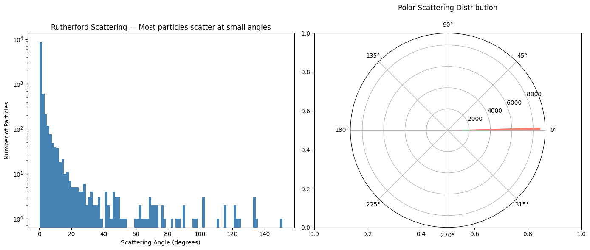
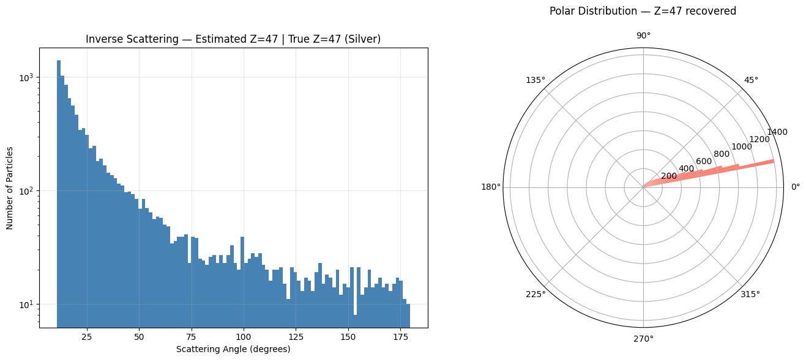
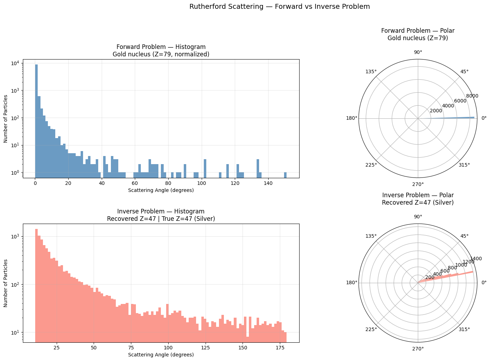

# ⚛️ Rutherford Particle Scattering Simulation

Monte Carlo simulation of the famous 1909 Rutherford gold foil experiment,
extended with an inverse scattering problem to identify unknown materials
from their scattering angle distribution alone.

## 🔬 Background

In 1909, Geiger and Marsden fired alpha particles at a thin gold foil and 
observed that while most passed straight through, a small fraction bounced 
back at large angles. This was Rutherford's proof that atoms have a dense 
central nucleus — one of the most important discoveries in physics.

This simulation reproduces that experiment computationally using the 
Rutherford scattering formula:

**θ = 2 · arctan(a / b)**

Where:
- θ = scattering angle
- b = impact parameter (how close the particle aims at the nucleus)
- a = Coulomb parameter (proportional to atomic number Z)

### Why the Inverse Problem?

The forward problem asks: *"Given a known material, what scattering 
distribution do we expect?"* — this is what Rutherford solved in 1909.

The inverse problem asks the opposite: *"Given only the scattering 
distribution, can we identify the unknown material?"* — this is what 
modern experimental physics actually does. When a new material is 
discovered, its atomic number is unknown. By firing particles at it 
and measuring the scattering angles, physicists can recover Z directly 
from the data using:

**Z_estimated = median(b · tan(θ/2))**

This is the same mathematical principle behind CT scanning, X-ray 
crystallography and nuclear material identification.

## 📊 Results

### Forward Problem — Gold Nucleus (Z=79)



- 10,000 alpha particles simulated
- ~97% scattered at angles < 10° → most particles miss the nucleus
- < 1% scattered at angles > 90° → rare direct hits
- Log scale reveals the exponential drop in large-angle scattering

### Inverse Problem — Unknown Material (Silver, Z=47)



- Scattering angles simulated for an unknown material
- Atomic number Z recovered purely from the angle distribution
- Median estimator used — robust against outliers from extreme angles

| Material | True Z | Estimated Z | Error |
|---|---|---|---|
| Silver | 47 | 47 | 0 |

### Forward vs Inverse Comparison



The 2×2 comparison shows histogram and polar distributions for both 
problems side by side. Despite looking visually similar, the two 
distributions encode completely different physical information — 
demonstrating that the inverse recovery is non-trivial.

## 🧠 Physics Concepts Demonstrated

- **Coulomb scattering** — electromagnetic repulsion between charged particles
- **Impact parameter** — geometric relationship between particle trajectory and nucleus
- **Forward problem** — known material → predict scattering distribution
- **Inverse problem** — observed scattering → identify unknown material
- **Median estimator** — robust statistical recovery of physical parameters
- **Log-scale histograms** — revealing rare large-angle scattering events

## 🔑 Key Insight

The inverse scattering result (Z estimated = Z true = 47) demonstrates 
that physical parameters can be recovered exactly from statistical 
distributions — even when individual particle trajectories are random. 
This is the foundation of all experimental particle physics: measuring 
distributions to infer fundamental properties of matter.

## 🌍 Real World Applications

The inverse scattering principle used here is the same mathematical 
foundation behind:
- CT scanning and medical imaging
- X-ray crystallography (determining molecular structure)
- Seismology (determining Earth's interior from earthquake waves)
- Nuclear material identification and non-destructive testing

## 🛠️ Tech Stack

- Python 3.11.9
- NumPy
- Matplotlib

## ▶️ How to Run

```bash
pip install numpy matplotlib
```
<<<<<<< HEAD
Open `notebooks/02_particle_scattering.ipynb` and run all cells in order.
=======
Open `02_particle_scattering.ipynb` and run all cells in order.
>>>>>>> 50a39fc9f63f25d04ee8de7e95a01d9dfb9225f7
