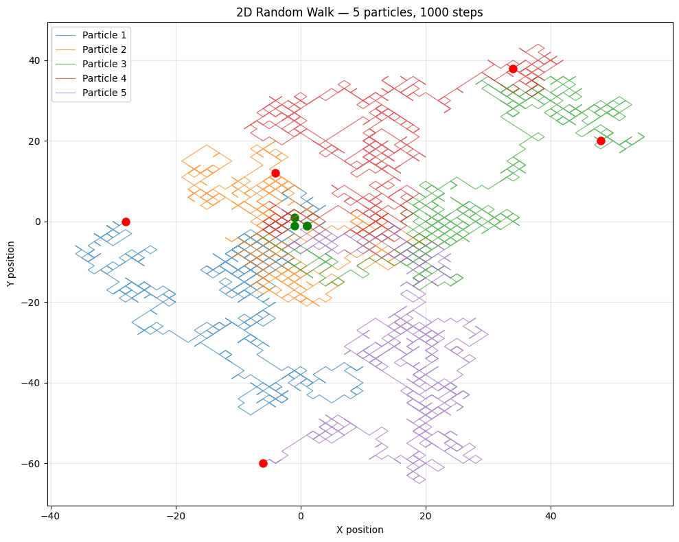
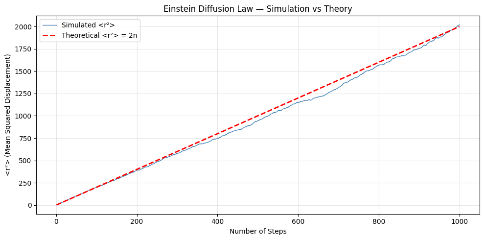

# 🚶 Random Walk & Einstein Diffusion Law

Simulating Brownian motion using 2D random walks and verifying 
Einstein's diffusion law computationally.

## 🔬 Background

A random walk models a particle that moves in a completely random 
direction at each step — left, right, up, or down with equal probability. 
This simple model describes:

- **Brownian motion** — pollen grains jiggling in water
- **Diffusion** — how gases and liquids spread
- **Stock prices** — financial market movements

Einstein showed in 1905 that the mean squared displacement of a 
diffusing particle grows linearly with time:

$\langle r^2 \rangle = 2Dt$

In our discrete simulation this becomes:

$\langle r^2 \rangle = 2n$

Where n is the number of steps and 2 accounts for both x and y dimensions.

## 📊 Results

### 2D Random Walk Paths



- 5 independent particles simulated
- 1,000 steps each
- Green dot → starting position
- Red dot → final position

### Einstein Diffusion Law Verification



- 1,000 independent walkers simulated
- Simulated $\langle r^2 \rangle$ closely matches theoretical prediction $\langle r^2 \rangle = 2n$
- **Einstein's diffusion law verified computationally**

## 🔑 Key Insight

The diffusion law verification uses fully vectorized NumPy operations — 
generating all 1,000 walker trajectories simultaneously as a 2D array 
rather than looping. This is orders of magnitude faster and demonstrates 
the power of scientific computing over naive iteration.

## 🧠 Physics Concepts Demonstrated

- **Brownian motion** — random thermal motion of particles
- **Mean squared displacement** — statistical measure of diffusion
- **Einstein diffusion law** — $\langle r^2 \rangle = 2Dt$  in 2D
- **Statistical averaging** — more walkers = smoother, more accurate result

## 🌍 Real World Applications

- **Medical physics** — drug diffusion through tissue
- **Materials science** — defect migration in crystals
- **Finance** — Black-Scholes option pricing model
- **Ecology** — animal foraging patterns

## 🛠️ Tech Stack

- Python 3.11.9
- NumPy
- Matplotlib

## ▶️ How to Run

```bash
pip install numpy matplotlib
```
Open `notebooks/03_random_walk.ipynb` and run all cells in order.
